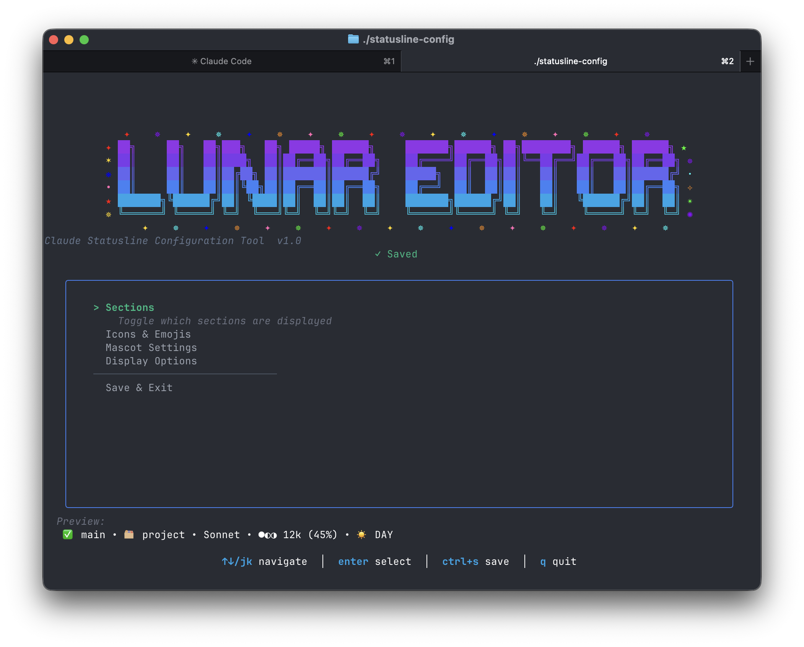
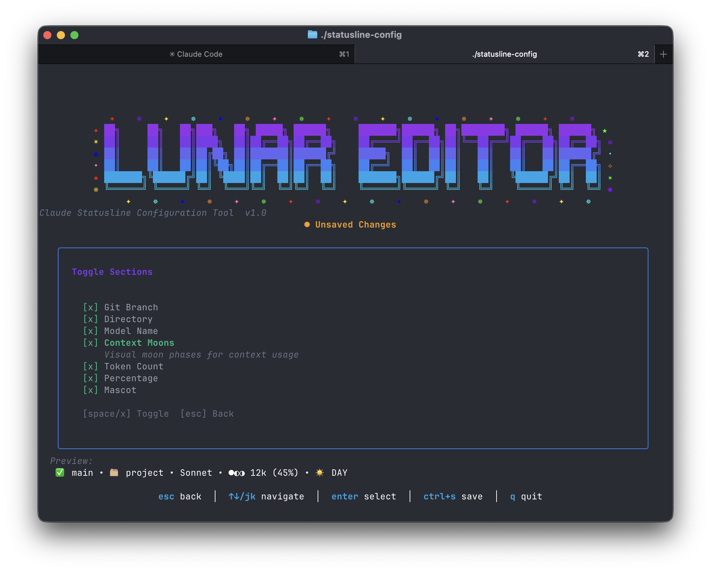

```
██╗     ██╗   ██╗███╗   ██╗ █████╗ ██████╗
██║     ██║   ██║████╗  ██║██╔══██╗██╔══██╗
██║     ██║   ██║██╔██╗ ██║███████║██████╔╝
██║     ██║   ██║██║╚██╗██║██╔══██║██╔══██╗
███████╗╚██████╔╝██║ ╚████║██║  ██║██║  ██║
╚══════╝ ╚═════╝ ╚═╝  ╚═══╝╚═╝  ╚═╝╚═╝  ╚═╝
```

A reactive, visual status line for Claude Code that shows what matters.

## What it shows

```
🌱 main │ 📁 coolest-project │ Opus 4.5 │ 🌕🌑🌑 195k (37%) │ 🚀 zooming!
```

- **Git status**: 🌱 clean / 🥀 uncommitted changes
- **Current directory**: Compact folder name
- **Model**: Which Claude you're talking to
- **Context usage**: Moon phases 🌑→🌕 showing how full your context window is
- **Reactive mascot**: Changes based on activity, time of day, and context pressure

## Install

1. Copy `statusline.sh` to your Claude config directory:
```bash
cp statusline.sh ~/.claude/statusline.sh
chmod +x ~/.claude/statusline.sh
```

2. Add to your `~/.claude/settings.json`:
```json
{
  "statusLine": {
    "type": "command",
    "command": "~/.claude/statusline.sh",
    "padding": 0
  }
}
```

3. Restart Claude Code

## Requirements

- `jq` for JSON parsing: `brew install jq` (macOS) or `apt install jq` (Linux)
- `bc` for math (usually pre-installed)
- Git (optional, for branch display)

## Mascot moods

The mascot adapts to your session:

- **Context panic** (>80%): 🫠 melting, 😰 tight fit, 🔥 toasty
- **Productive** (>200 lines added): 🚀 zooming, ⚡ on fire, 💪 crushing it, 🎯 locked in
- **Cleanup mode** (more deletions): 🧹 cleaning, ✂️ snip snip, 🗑️ declutter
- **Chill vibes**: Time-of-day themed (🦉 night owl, ☀️ morning, 🎧 in the zone, 🌆 evening)

Rotates every ~10 seconds to stay fresh without being distracting.

## Configuration Editor

A TUI for customizing your statusline without editing files.





```bash
./lunar-editor-macos   # macOS
./lunar-editor-linux   # Linux
./lunar-editor.exe     # Windows
```

Configure sections, icons, mascot moods, and display settings.

---

Built for context awareness and vibes.
