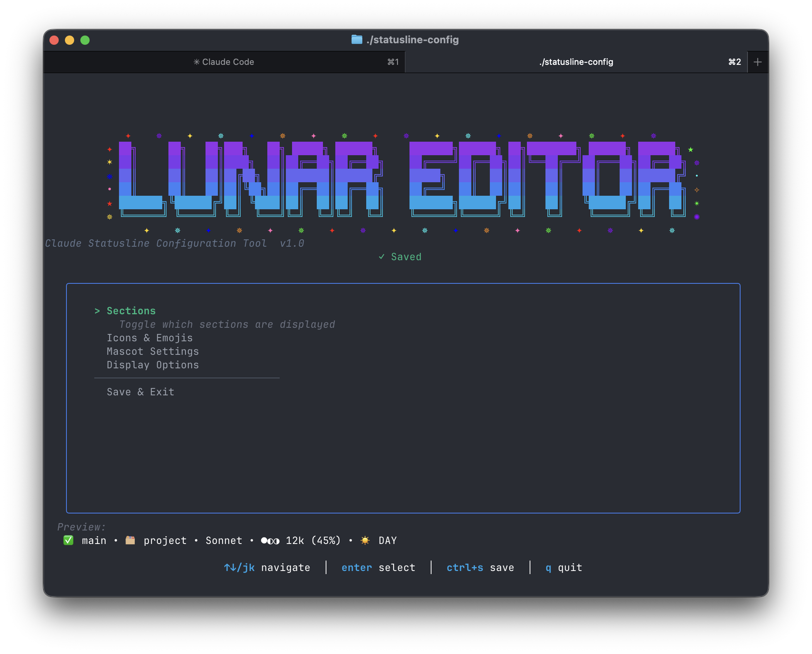
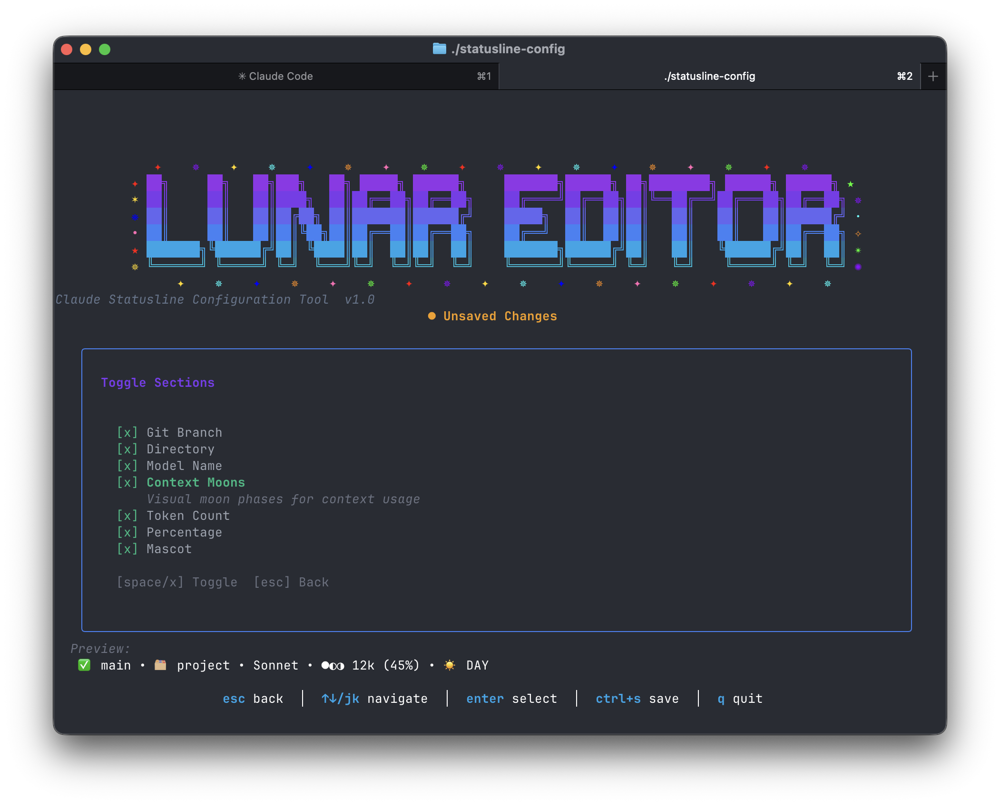

```
██╗     ██╗   ██╗███╗   ██╗ █████╗ ██████╗
██║     ██║   ██║████╗  ██║██╔══██╗██╔══██╗
██║     ██║   ██║██╔██╗ ██║███████║██████╔╝
██║     ██║   ██║██║╚██╗██║██╔══██║██╔══██╗
███████╗╚██████╔╝██║ ╚████║██║  ██║██║  ██║
╚══════╝ ╚═════╝ ╚═╝  ╚═══╝╚═╝  ╚═╝╚═╝  ╚═╝
```

A reactive, visual status line for Claude Code that shows what matters.

## What it shows

```
🔔 WAITING (2m) │ 🌱 main │ 📁 coolest-project │ Opus 4.5 │ 🌕🌑🌑 195k (37%) │ 🚀 zooming!
```

- **Waiting indicator**: Alert when Claude needs your input (permission, question, etc.)
- **Git status**: 🌱 clean / 🥀 uncommitted changes
- **Current directory**: Compact folder name
- **Model**: Which Claude you're talking to
- **Context usage**: Moon phases 🌑→🌕 showing how full your context window is
- **Reactive mascot**: Changes based on activity, time of day, and context pressure

## Install

### Requirements

- `jq` for JSON parsing (the installer will check for this)
  - macOS: `brew install jq`
  - Ubuntu/Debian: `sudo apt install jq`
  - Arch: `sudo pacman -S jq`
- `bc` for math (usually pre-installed)
- Git (optional, for branch display)

### Quick Install

```bash
git clone https://github.com/anthropics/claude-statusline.git ~/.claude/claude-statusline
cd ~/.claude/claude-statusline
./install-hooks.sh
```

This will:
- Copy `statusline.sh` to `~/.claude/statusline.sh`
- Copy hook scripts to `~/.claude/hooks/`
- Add `statusLine` and `hooks` entries to `~/.claude/settings.json` (safely merges with existing config)

Running the installer again is safe — it will update hooks without creating duplicates.

### Updating

Lunar auto-updates itself. Each time you start a Claude Code session, it checks for updates in the background (at most once per 24 hours). If a new version is available, it pulls and re-installs silently.

**Already installed?** Run one last manual update to enable auto-updates:

```bash
cd ~/.claude/claude-statusline
git pull && ./install-hooks.sh
```

After that, you'll never need to update manually again.

**Opt out** by adding to `~/.claude/.statusline.config`:

```json
{
  "auto_update": {
    "enabled": false
  }
}
```

You can also change the check frequency with `"check_interval_hours": 48` (default: 24).

### Manual Install

1. Copy `statusline.sh` to your Claude config directory:
```bash
cp statusline.sh ~/.claude/statusline.sh
chmod +x ~/.claude/statusline.sh
```

2. Copy hook scripts:
```bash
mkdir -p ~/.claude/hooks
cp hooks/set-waiting.sh hooks/clear-waiting.sh hooks/update.sh ~/.claude/hooks/
chmod +x ~/.claude/hooks/set-waiting.sh ~/.claude/hooks/clear-waiting.sh ~/.claude/hooks/update.sh
```

3. Add to your `~/.claude/settings.json`:
```json
{
  "statusLine": {
    "type": "command",
    "command": "~/.claude/statusline.sh",
    "padding": 0
  },
  "hooks": {
    "Notification": [
      {
        "matcher": "idle_prompt|permission_prompt|elicitation_dialog",
        "hooks": [{ "type": "command", "command": "~/.claude/hooks/set-waiting.sh" }]
      }
    ],
    "PermissionRequest": [
      { "hooks": [{ "type": "command", "command": "~/.claude/hooks/set-waiting.sh" }] }
    ],
    "UserPromptSubmit": [
      { "hooks": [{ "type": "command", "command": "~/.claude/hooks/clear-waiting.sh" }] }
    ],
    "PostToolUse": [
      { "hooks": [{ "type": "command", "command": "~/.claude/hooks/clear-waiting.sh" }] }
    ],
    "SessionStart": [
      { "hooks": [{ "type": "command", "command": "~/.claude/hooks/clear-waiting.sh" }] },
      { "hooks": [{ "type": "command", "command": "~/.claude/hooks/update.sh" }] }
    ]
  }
}
```

4. Restart Claude Code

## Waiting Indicator

Never miss when Claude needs your attention. The statusline shows a prominent alert when:

- Claude asks a question (AskUserQuestion)
- A permission prompt appears ("Allow Claude to run...?")
- Any dialog requiring user input

The indicator shows how long Claude has been waiting:
```
🔔 WAITING (2m) │ ...rest of status...
```

**How it works**: Uses Claude Code hooks to detect waiting states and writes to a state file that the statusline reads.

**Customize** in `~/.claude/.statusline.config`:
```json
{
  "waiting_indicator": {
    "icon": "🔔",
    "text": "WAITING",
    "blink": true
  },
  "notifications": {
    "terminal_bell": {
      "enabled": true
    },
    "desktop": {
      "enabled": true,
      "sound": true,
      "sound_volume": 1
    },
    "terminal_title": {
      "enabled": true,
      "waiting_text": "⚠️ WAITING - Claude needs input",
      "normal_text": "Claude Code"
    }
  }
}
```

**Notification options:**
- `terminal_bell` - Classic `\a` bell (works in most terminals)
- `desktop` - Native OS notification (macOS/Linux) with optional sound
- `terminal_title` - Changes your terminal window/tab title when waiting

## Mascot moods

The mascot adapts to your session:

- **Context panic** (>90%): 😰 😱 🆘 - running out of context!
- **Productive** (>100 lines added): 🔨 ⚒️ 🛠️ - building things
- **Cleanup mode** (more deletions): 🧹 ✨ 🗑️ - tidying up
- **Time-based** (default): 🦉 night / ☀️ morning / 💻 afternoon / 🌆 evening

**Note:** The mascot changes each time the statusline refreshes. It won't animate continuously, but will show different states based on current conditions.

## Configuration Editor

A TUI for customizing your statusline without editing files.





```bash
./lunar-editor-macos   # macOS
./lunar-editor-linux   # Linux
./lunar-editor.exe     # Windows
```

Configure sections, icons, mascot moods, and display settings.

---

Built for context awareness and vibes.
